# RealMate Webchat Challenge

Bem-vindo ao desafio RealMate Webchat! Este repositório reúne o backend em Django + Celery e o frontend em Next.js para implementar um sistema de webchat em tempo real.

## 📋 Visão Geral

O objetivo deste projeto é permitir a troca de mensagens entre usuários e um agente (bot) de forma síncrona e assíncrona, utilizando WebSockets e processamento assíncrono de tarefas. A arquitetura principal envolve:

- **Django** para construir a API REST e gerenciamento de autenticação.
- **Django Channels** para comunicação em tempo real via WebSockets.
- **Celery** para processamento assíncrono (envio de mensagens, tarefas periódicas, etc.).
- **Next.js** para o frontend React, com renderização híbrida (SSR & SSG).
- **PostgreSQL** como banco de dados relacional.
- **Redis** como broker e backend de resultados do Celery.

## 🚀 Tecnologias

- Python 3.13
- Django, Django Channels, Celery
- Node.js 16+, Next.js, React
- PostgreSQL
- Redis
- Docker & Docker Compose

## 🛠 Pré-requisitos

- Docker >= 20.10
- Docker Compose v2
- (Opcional) Python >= 3.13 e Poetry
- (Opcional) Node.js >= 16

## ⚙️ Configuração de Ambiente

1. Copie o arquivo de variáveis de ambiente:
   ```bash
   cp docs/env.example .env
   ```
2. Ajuste as variáveis em `.env` caso necessário:
   ```dotenv
   POSTGRES_DB=postgres
   POSTGRES_USER=postgres
   POSTGRES_PASSWORD=postgres
   POSTGRES_HOST=db
   POSTGRES_PORT=5432
   REDIS_URL=redis://redis:6379/0
   CELERY_BROKER_URL=redis://redis:6379/0
   CELERY_RESULT_BACKEND=redis://redis:6379/0
   ```

## 💿 Deploy

Para efetuar o deploy tanto manualmente quanto de forma automatizada (com docker), consulte o arquivo 'docs/INSTRUCTIONS.md'


## 📂 Estrutura do Projeto

```
realmate-webchat-challenge/
├── docker-compose.yml
├── dockerfile
├── docs/                  # Documentação e exemplos de environment
├── realmate_challenge/    # Backend Django + Channels + Celery
│   ├── frontend/          # Frontend Next.js
│   └── ...
└── webhook_api/           # Módulo de Webhooks e processamento de eventos
```

## 🏗 Arquitetura



## 📄 Licença

Este projeto está licenciado sob a Licença MIT. Consulte o arquivo `LICENSE` para mais detalhes.
